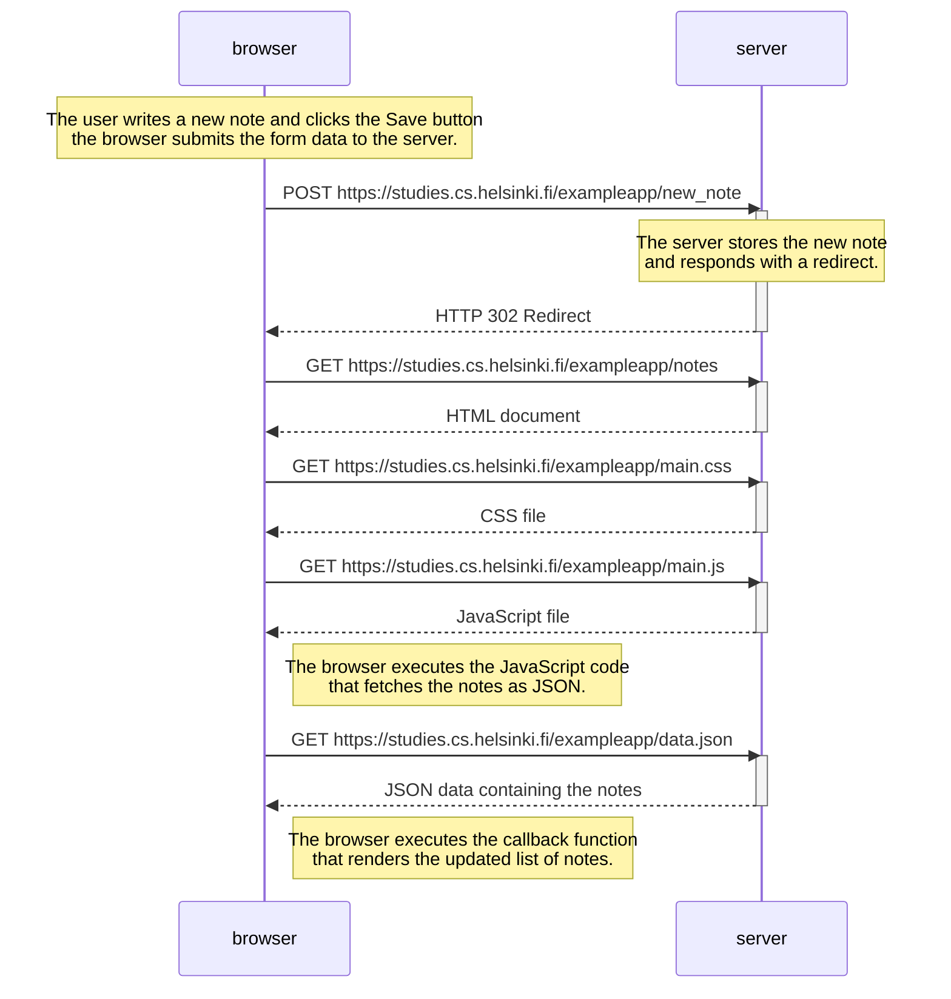

```mermaid
sequenceDiagram
    participant browser
    participant server

    Note over browser: The user writes a new note and clicks the Save button<br/>the browser submits the form data to the server.

    browser->>server: POST https://studies.cs.helsinki.fi/exampleapp/new_note
    activate server

    Note over server: The server stores the new note<br/>and responds with a redirect.

    server-->>browser: HTTP 302 Redirect
    deactivate server

    browser->>server: GET https://studies.cs.helsinki.fi/exampleapp/notes
    activate server
    server-->>browser: HTML document
    deactivate server

    browser->>server: GET https://studies.cs.helsinki.fi/exampleapp/main.css
    activate server
    server-->>browser: CSS file
    deactivate server

    browser->>server: GET https://studies.cs.helsinki.fi/exampleapp/main.js
    activate server
    server-->>browser: JavaScript file
    deactivate server

    Note right of browser: The browser executes the JavaScript code<br/>that fetches the notes as JSON.

    browser->>server: GET https://studies.cs.helsinki.fi/exampleapp/data.json
    activate server
    server-->>browser: JSON data containing the notes
    deactivate server

    Note right of browser: The browser executes the callback function<br/>that renders the updated list of notes.
```