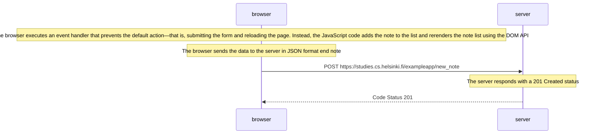

```mermaid
sequenceDiagram
  participant browser
  participant server

  Note over browser: The browser executes an event handler that prevents the default action—that is, submitting the form and reloading the page. Instead, the JavaScript code adds the note to the list and rerenders the note list using the DOM API

  Note over browser:The browser sends the data to the server in JSON format end note

  browser->>server: POST https://studies.cs.helsinki.fi/exampleapp/new_note

  Note over server: The server responds with a 201 Created status
  server-->>browser: Code Status 201
```