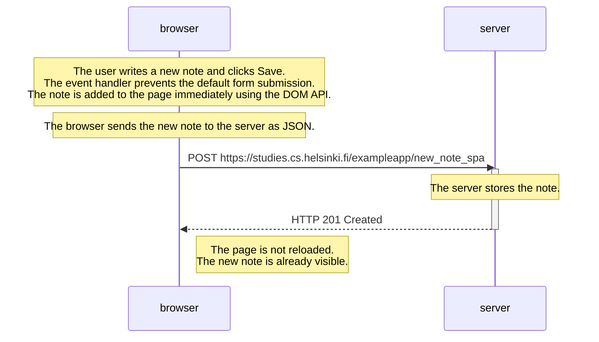

```mermaid
  sequenceDiagram
    participant browser
    participant server

    Note over browser: The user writes a new note and clicks Save.<br/>The event handler prevents the default form submission.<br/>The note is added to the page immediately using the DOM API.

    Note over browser: The browser sends the new note to the server as JSON.

    browser->>server: POST https://studies.cs.helsinki.fi/exampleapp/new_note_spa

    activate server
    Note over server: The server stores the note.
    server-->>browser: HTTP 201 Created
    deactivate server

    Note right of browser: The page is not reloaded.<br/>The new note is already visible.
```